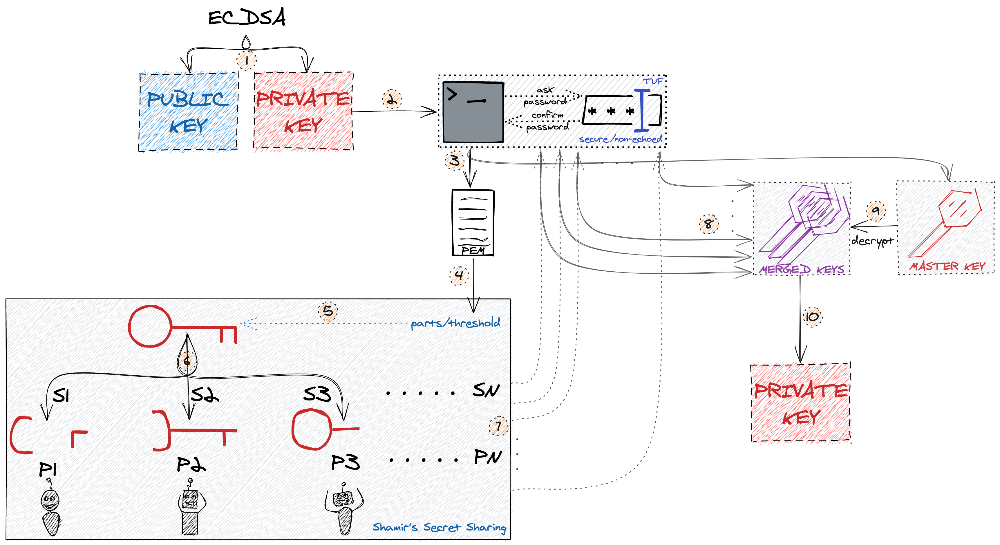
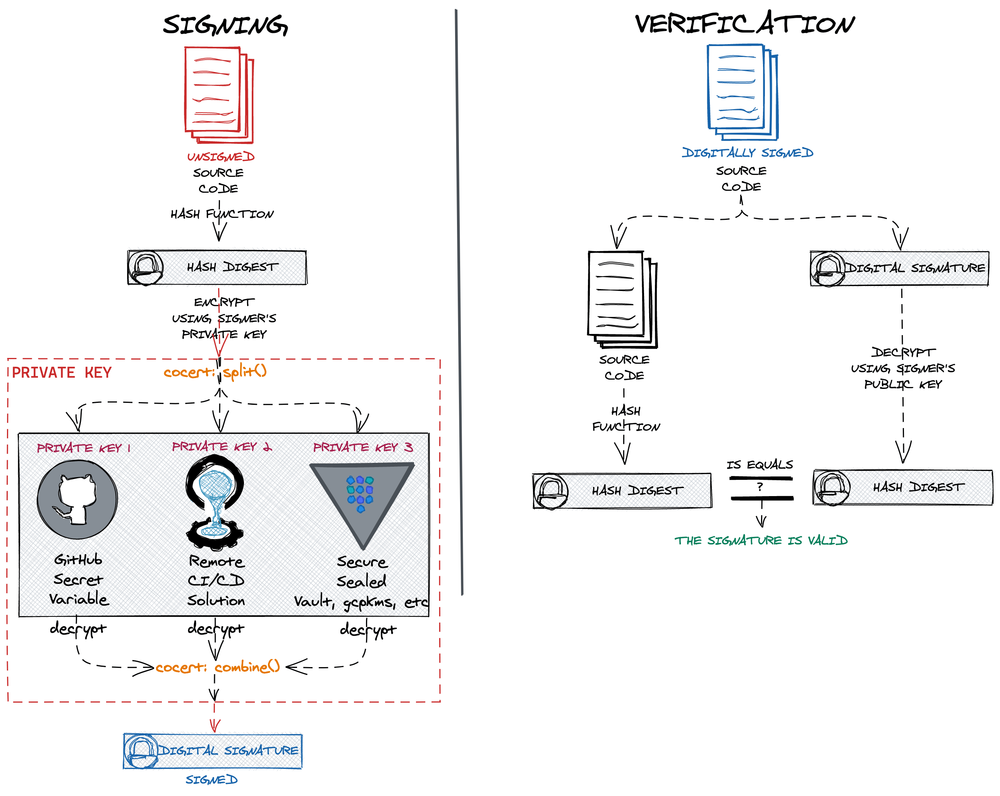

<p align="center"><a href="https://github.com/Dentrax/cocert" target="_blank"></a></p>

<h1 align="center">cocert</h1>

<div align="center">
 <strong>
   An experimental tool for splitting and distributing your private keys safely*
 </strong>
</div>

<br />

<p align="center">
  <a href="https://opensource.org/licenses/MIT"></a>
  <a href="https://github.com/Dentrax/cocert/releases/latest"></a>
  <a href="https://goreportcard.com/report/github.com/Dentrax/cocert"></a>
  <a href="https://github.com/Dentrax/cocert/actions?workflow=test"></a>
</p>

<br />

*cocert*, generates [ECDSA](https://en.wikipedia.org/wiki/Elliptic_Curve_Digital_Signature_Algorithm) - [P521](https://en.wikipedia.org/wiki/Elliptic-curve_cryptography) key and uses a technique known as [Shamir's Secret Sharing](https://en.wikipedia.org/wiki/Shamir's_Secret_Sharing) algorithm to split the master key into _x_ shares, any _y_ of which are required to reconstruct the master private key. Private keys are stored in [PEM-encoded](https://en.wikipedia.org/wiki/Privacy-Enhanced_Mail) [PKCS8](https://en.wikipedia.org/wiki/PKCS_8) format, which are [encrypted](https://pkg.go.dev/github.com/theupdateframework/go-tuf/encrypted) by [The Update Framework (TUF)](https://github.com/theupdateframework/go-tuf). Each private key is splitted using [Shamir](https://pkg.go.dev/github.com/hashicorp/vault/shamir) [Split](https://pkg.go.dev/github.com/hashicorp/vault/shamir#Split). To [Combine](https://pkg.go.dev/github.com/hashicorp/vault/shamir#Combine) private key files into single one, it is necessary to enter decrypt password if it has been encrypted by TUF.

*cocert does not support any [Distributed Key Generation (DGK)](https://en.wikipedia.org/wiki/Distributed_key_generation) algorithm, yet.

_This repository is [signed](https://github.com/Dentrax/cocert/blob/9d9f18743c9602289dfec3c98d49b68c549d40bf/.github/workflows/publish.yml#L56-L69) via [cosign](https://github.com/sigstore/cosign), by using `cocert` itself_


[Asciinema](https://asciinema.org/a/411543)

# High Level Architecture



# Use-Case Example

* What happens if your private key is exposed by either public 3rd-party cloud service provider or internal security breach?
  
Your private key would have compromised and supply chain attacks would inevitable. What would happen if we not trust just one key, however, distribute our key to multiple secure environments? We would avoid supply chain attacks, that said, even if one of our private keys is compromised, we still need two more keys to combine and get the final private key.



# Installation

* Go
```bash
$ go install github.com/Dentrax/cocert@latest
```

* Docker
```bash
$ docker pull ghcr.io/dentrax/cocert
```

# Verify

## Prerequities
1. [cosign](https://github.com/sigstore/cosign)
2. [crane](https://github.com/google/go-containerregistry/tree/main/cmd/crane)

## Check

```bash
# 1. Download the public key
$ curl https://raw.githubusercontent.com/Dentrax/cocert/main/.github/workflows/certs/cocert.pub -o cocert.pub

# 2. Verify
$ cosign verify -key cocert.pub ghcr.io/dentrax/cocert | jq

# 3. Make sure verified commit matches the digest of the latest image 
$ crane digest ghcr.io/dentrax/cocert
```

# Usage

```bash
Usage:
  cocert [command]

Available Commands:
  combine     Combine the cert integrity on the supplied PEM files
  decrypt     Decrypt the target private keys using TUF
  encrypt     Encrypt the target private keys using TUF
  generate    Generates TUF encrypted keys using ECDSA and splits into PKCS8-PKIX key-pairs
  help        Help about any command
  sign        Sign the given payload and create a certificate from Fulcio
  split       Split your existing private key into parts
  verify      Verify the given payload on the supplied signature

Flags:
  -h, --help   help for cocert
```

## Use-Case Demonstration

1. Generate
```bash
$ cocert generate --parts 3 --threshold 2

Generating TUF encrypted Shamir PEMs...
Create new password for private key:  (master)
Confirm password: (master)
Extracting PEMs to files...
Do you want to encrypt each key using TUF? (y/n) [n]: y
Create new password for cocert0.key key: (foo)
Create new password for cocert1.key key: (bar)
Create new password for cocert2.key key: (baz)
```

2.1. Sign with Private Key
```bash
$ cocert sign -f cocert0.key -f cocert1.key -p "Foo Bar Baz"

(Press Enter to continue without decrypt...)
Enter your password for cocert0.key: (foo)
Enter your password for cocert1.key: (bar)
Enter your master key: (master)
Signed: MIGIAkIBCisWXRLBRcv/...+3pccRjm+nUNA==
```

2.2. Sign with [Fulcio](https://github.com/sigstore/fulcio) (Keyless)
```bash
$ cocert sign -f cocert0.key -f cocert1.key  -p "Foo Bar Baz" -o my.cert

(Press Enter to continue without decrypt...)
Enter your password for cocert0.key: (foo)
Enter your password for cocert1.key: (bar)
Enter your master key: (master)
Your browser will now be opened to:
https://oauth2.sigstore.dev/auth/auth?access_type=online&client_id=sigstore&code_challenge=CODE&code_challenge_method=S256&nonce=NONCE&redirect_uri=http%3A%2F%2Flocalhost%3A5556%2Fauth%2Fcallback&response_type=code&scope=openid+email&state=STATE
Signed: MIGIAkIBCisWXRLBRcv/...+3pccRjm+nUNA==
```

3.1. Verify with Public Key
```bash
$ cocert verify -f cocert.pub -p "Foo Bar Baz" -k "MIGIAkIBCisWXRLBRcv/...+3pccRjm+nUNA=="
```

3.2. Verify with Certificate
```bash
$ cocert verify -c my.cert -p "Foo Bar Baz" -k "MIGIAkIBCisWXRLBRcv/...+3pccRjm+nUNA=="
```

**Bonus:** Splitting
```bash
# 1. Generate the your custom private key
$ cosign generate-key-pair

Enter password for private key: (qux)
Private key written to cosign.key
Public key written to cosign.pub

# 2. Split the key
$ cocert split -f private.key --parts 3 --threshold 2

Create new password for cocert0.key key: (foo)
Create new password for cocert1.key key: (bar)
Create new password for cocert2.key key: (baz)

# 3. Test with combine
$ cocert combine -f cocert0.key -f cocert1.key -o cosign.key

Enter your password for cocert0.key: (foo)
Enter your password for cocert1.key: (bar)
Decrypting TUF encrypted PEMs...
Enter your master key: (qux)
Combined
```

## Encrypt & Decrypt Keys

* Encrypt
```bash
$ cocert encrypt -f cocert0.key -o "cocert0.key.encrypted"

Enter your password for : (foo2)
Confirm password: (foo2)
```

* Decrypt
```bash
$ cocert decrypt -f cocert0.key.encrypted -o "cocert0.key.decrypted"
# [[ $(md5 -q cocert0.key) -eq $(md5 -q cocert0.key.decrypted) ]]

Enter your password for : (foo2)

$ cocert decrypt -f cocert0.key.decrypted -o "cocert0.key.unencrypted"
# You can pass empty password for 'cocert0.key.unencrypted' key

Enter your password for : (foo)
```

* Combine

```bash
$ cocert combine -f cocert0.key.unencrypted -f cocert1.key 

Loading PEMs from files...
(Press Enter to continue without decrypt...)
Enter your password for cocert0.key.unencrypted: (PASS)
Enter your password for cocert1.key: (bar)
Decrypting TUF encrypted PEMs...
Enter your master key: (master)
Combined
```

# Special Thanks

| Package                                                       | Author                                                  | License                                                                                      |
| :------------------------------------------------------------ | :------------------------------------------------------ | :------------------------------------------------------------------------------------------- |
| [cosign](https://github.com/sigstore/cosign) | [sigstore](https://github.com/sigstore) | [Apache License 2.0](https://github.com/sigstore/cosign/blob/main/LICENSE) |
| [go-tuf](https://github.com/theupdateframework/go-tuf) | [The Update Framework](https://github.com/theupdateframework) | [BSD](https://github.com/theupdateframework/go-tuf/blob/master/LICENSE) |
| [Vault](https://github.com/hashicorp/vault) | [HashiCorp](https://github.com/hashicorp) | [Mozilla Public License 2.0](https://github.com/hashicorp/vault/blob/master/LICENSE) |
| [prompter](https://github.com/Songmu/prompter) | [Songmu](https://github.com/Songmu) | [MIT](https://github.com/Songmu/prompter/blob/main/LICENSE) |

- Thanks to everyone who contributed these libraries and [others](https://github.com/Dentrax/cocert/blob/main/go.mod) that made this project possible.

# License

*cocert* was created by [Furkan 'Dentrax' Türkal](https://twitter.com/furkanturkaI)

The base project code is licensed under [MIT](https://opensource.org/licenses/MIT) unless otherwise specified. Please see the **[LICENSE](https://github.com/Dentrax/cocert/blob/main/LICENSE)** file for more information.

<kbd>Best Regards</kbd>